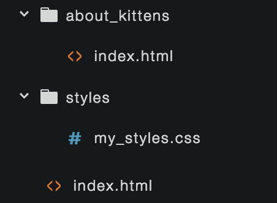

# HTML+CSS Basics

The HTML+CSS Basics Workshop is a one-day introduction to creating web content. This class will focus on practical, technical skills with hands-on challenges and lots of time to practice and ask questions. Topics will include writing basic HTML and CSS, working with images and links, finding answers online, and using the development tools built into chrome.

Time 		| Unit
---			| ---
:30		 	| Semantic Markup: How HTML and CSS work together
1:15		| HTML: Marking up a web page
:45			| Documentation: How to find answers
1:15		| CSS: Styling a web page
:30 		| Using the Chrome developer tools
:30			| Using VS Code and Working Locally
:45			| Links, Images, Paths
:30			| Mac OS Command Line Basics
:30			| Git Basics
:30			| Github
:30 		| Github Pages


## Workshop Structure
- This workshop is divided into several parts. Each part begins with a brief introduction, followed by a hands-on exercise.
- If you get done early, keep exploring. If you don't get done, don't worry.
- At the end of each exercise we'll show and discuss an 'expert' solution.
- We will stick to the practical aspects; we won't get into the technical background.
- We will stick to the very high-level basics, focusing on how everything works together.
- A lot of important topics **won't** be covered: changing fonts, controlling box layout, etc.
- Fortunately, we **will** cover how to look that stuff up later.
- Inductive vs Inductive approach

## Semantic Markup: How HTML and CSS work together

### Learning Objectives
- What semantic markup is
- How HTML and CSS work together
- Practice identifying semantic structure of a document

### Overview
In documents, different words have different purposes. Some words form titles, some words form regular paragraphs, some are parts of lists. In web development these purposes are referred to as _semantics_. Often the semantic purpose of text informs how it should be styled. Title text is often bigger than paragraph text. Lists may be indented.

HTML and CSS are used together to explain the semantics of documents how they should look. HTML is used to describe the semantics of the document in a way that a web browser can understand. CSS is used to set style properties such as the font size and color to associate with different types of content.

If you want to make all the lists on a web page red, you need to use HTML to "mark up" where the lists are, and CSS to color them.

### More Information
- [Wikipedia: Semantic HTML](https://en.wikipedia.org/wiki/Semantic_HTML)
- [HTML5Doctor: Let's Talk about Semantics](http://html5doctor.com/lets-talk-about-semantics/)

### Challenge
Semantically mark up the New York Times.
[10 min]


## HTML: Marking up a web page

### Learning Objectives
- What HTML is
- HTML tag syntax
- Common HTML tags and semantic meaning
- Practice using HTML to mark up text documents


### Overview
HTML stands for HyperText Markup Language. It is used to provide information about the structure, organization, and purpose of content on a web page.

Properly marked up content can be understood by the web browser, allowing it to style the document way you want. Styles are defined in a separate language called CSS.

HTML 			| CSS 					| Javascript
---				| ---					| ---
Content			| Style					| Behavior
What it says	| What it looks like 	| What it does

#### HTML Syntax

Here is an example of a very basic HTML web page.

```html
<!DOCTYPE html>
<html>
	<head>
		<title>HTML Basics</title>
	</head>
	<body>
		<h1>Hello, world.</h1>
        <p>This is a basic web page.</p>
		
	</body>
</html>
```

A few things to note in the above example:

- HTML uses tags (like `<h1>`) to mark up the purpose of text in a document.
- Most HTML tags work in pairs and surround the text they describe: `<h1>...</h1>`
- Opening tags look like this: `<h1>` and `<body>` and `<p>`
- Closing tags look like this: `</h1>` and `</body>` and `</p>`
- Tags can be nested: `<h1>` is  inside `<body>` and `<body>` is inside `<html>`
- Some tags, such as `<br>` and ``, insert content into a page. Because these tags no not enclose content, they do not have a closing tag.

#### Important HTML Tags

| Tag          | Purpose                                                                          |
| ------------ | -------------------------------------------------------------------------------- |
|              |
| `html`       | wraps the entire document                                                        |
| `head`       | used to contain information that is not displayed on the web page                |
| `title`      | used to mark text that should be displayed in the document's tab (and bookmarks) |
| `body`       | used to mark the main content of the document                                    |
|              |
| `h1`         | Headlines                                                                        |
| `h2`..`h6`   | Less important headlines                                                         |
| `p`          | Paragraphs                                                                       |
| `br`         | Creates a line break without starting a new paragraph (unpaired)                 |
|              |
| `ol`         | A numbered list                                                                  |
| `ul`         | An unnumbered list                                                               |
| `li`         | An item in a list                                                                |
|              |
| `em`         | *emphasized text*                                                                |
| `strong`     | **strong text**                                                                  |
| `code`       | `code text`                                                                      |
| `blockquote` | Extended quotation                                                               |
|              |
| `a`          | creates a link                                                                   |
| `img`        | inserts an image (unpaired)                                                      |


### Important Note
In interesting feature of HTML is that browsers will try _very_ hard to show your document, even if there are mistakes in your HTML. In some ways this makes it easier to user and learn HTML: a simple mistake won't bring your whole page down. In other ways it makes it harder to learn and use: you don't get clear, immediate feedback when you make a mistake.

### More Information
- [Learn to Code HTML & CSS](http://learn.shayhowe.com/html-css/)
- [MDN: HTML](https://developer.mozilla.org/en-US/docs/Web/HTML)

### Challenge
- Open the "challenge" link below.
- Add HTML tags to mark up the semantic structure of the text.
- Try to make the rendered HTML match the "goal" link below.

[Challenge](https://jsbin.com/maronimafi/edit?html,output)
->
[Goal](challenges/challenge_html_solution.html)


## Documentation: How to find answers

### Learning Objectives
- Using Google to find technical information
- High-quality reference sites
- Practice finding information

### Overview
Webpages are built with three programming languages (HTML, CSS, and Javascript) and run on a variety of web browsers each with their own quirks. That is a lot of information to try to remember, and web technologies are constantly changing and growing. Finding technical answers online quickly is one of the most important skills required when making webpages.

Like any skill, you get better at searching for info when you practice.


### Tips for using Google for Technical Information
- Include the language in your search. `rounded corner` -> `rounded corner css`
- Include a reputable site in your search. `border properties` -> `border properties mdn`
- If the first few results are not what you are looking for, try a different search. `dotted line css` -> `dotted border css`
- Scan the first few results before you click.
- Look for titles that closely match what you are looking for.
- Look for sources that have been useful before.
- Don't forget that your browser can search for terms on a page: `command-f`
- Most common info can be found quickly. If you are not obviously on the right webpage for your answer, don't spend time on it. Go back to the search results and pick something else, or try rephrasing your search.
- Don't always use google. If you are looking for info on a particular HTML tag, CSS attribute, or JS function, a tool like devdocs.io might be better.


#### Good Sources

| Site                                         | Description                                                                                   |
| -------------------------------------------- | --------------------------------------------------------------------------------------------- |
| [DevDocs](http://devdocs.io/)                | Online reference application with info for *many* popular web technologies.                   |
| [Stack Overflow](http://stackoverflow.com/)  | Question and answer site with huge, well-curated database                                     |
| [MDN](https://developer.mozilla.org/en-US/)  | Detailed, reliable technical documentation on HTML/CSS/Javascript and other web technologies. |
| [HTML5Rocks](https://www.html5rocks.com/en/) | Tutorials and articles on specific aspects of HTML5                                           |
| [CSSTricks](https://css-tricks.com/)         | Tutorials, quick reference, and other resources related to CSS                                |


#### Challenge
- Answer the questions in the quiz linked below.
- This is an open-web quiz; you may use any website you like to find answers to the quiz questions.
- If you have extra time, spend some time reading up on topics included in the quiz.

[Finding Answers Quiz](https://goo.gl/forms/3N8oY4Vx0IPILUNK2)


## Lunch


## CSS: Styling a web page

### Learning Objectives
- What CSS is
- CSS rule-set syntax
- Common CSS properties
- Practice using CSS to style html documents


### Overview
CSS stands for Cascading Style Sheets. CSS is used to describe presentation styles for elements on a web page. CSS allows you to specify the size and color of text, borders, shadows, even the overall layout of the page.

HTML 			| CSS 					| Javascript
---				| ---					| ---
Content			| Style					| Behavior
What it says	| What it looks like 	| What it does

#### CSS Syntax

First, lets look at some css:

```html
h1 {
	font-size: 50px;
	color: red;
}

h2, h3 {
	font-size: 25px;
}

h3 {
	color: blue;
}
```

The example above has three **rulesets**. Lets look at the first one more closely:

```html
h1 {
	font-size: 50px;
	color: red;
}
```

This ruleset tells the browser to make all the `<h1>` elements on the webpage **big** and **red**. A few things to note about rulesets:

- Rulesets begin with a **selector**. The selector above is `h1`. This selector tells css that the following styles should be applied to any `h1` elements on the page.
- Rulesets may have more than one selector, separated with commas: `h1, h2`
- After the selector a pair of braces `{}` group two **declarations**.
- Declarations begin with a **property**: `color`;
- .. continue with a `:`
- .. followed by a **value**: `red`
- .. and end with `;`

#### Important CSS Properties

| Tag | Example Values | Purpose |
| --- | -------------- || ---
`color` 			| `red` `#00FF00` 	| Sets the font color
`background-color`	| `red` `#00FF00` 	| Sets the background color
|
`font-size`  		| `12px` `2em`		| Sets the size of the font
`font-weight`		| `bold` `normal`	| The font weight
`font-style`		| `italic` `normal` | Specify style variation of a font
`line-height`		| `1` `1.5`			| Spacing between lines of text
|
`padding`			| `5px` `1em`		| Extra space inside element
`margin`			| `5px` `1em`		| Extra space outside element
`margin-left`		| `5px` `1em`		| Just the left margin

`margin`, `padding`, `border` can be applied all the way around an element or just to the `-top`, `-right`, `-bottom`, or `-left`.

#### Inheritance

When a CSS property is applied to an element, it may be applied to the element's children as well. This is called **inheritance**.

In the following example, the color property will be applied to the `p` element. The `strong` element's text will also be red because the color property is inherited.

```
<p>This paragraph has a <strong>bold part</strong></p>
```
```
p { color: red; }
```

Not all CSS properties are inherited. You can check the [MDN CSS reference](https://developer.mozilla.org/en-US/docs/Web/CSS/Reference) to find out if a property is inherited.


#### Classes
Generally it good CSS practice to apply styles broadly. For example, you might make all `h1`s look a certain way. This leads to shorter, easier to understand CSS and more consistent visual design. In practice, however, you often need to get more specific. You might want a few `h1`s to be a different color for example.

You can use HTML and CSS together to create and style **classes**. Classes let you specify a specific set of elements.

```
<h1>Apples</h1>
<p>Apples are fruit.</p>

<h1 class="important">Bears</h1>
<p>Apples are animals.</p>

<h1>Cake</h1>
<p class="important">Cake is delicious.</p>
```
```
h1 {
	color: gray;
}
.important {
	color: pink;
}
```

- In the HTML, a class **attribute** was added to two tags in the HTML.
- In the CSS, a selector starting with `.` is used to apply a ruleset to elements marked with the `important` class.
- Use classes to describe the semantics of items in your document, not how you plan to style them.

#### Specificity + The Cascade

It is common that two rulesets will apply to the same element. In the example above, both the `h1` ruleset and the the `.important` ruleset apply to the "Bears" header. Since both rulesets set the `color` property, css must choose which property value to use. The set of rules that determines which rule to apply is called the *cascade*. Crucially, CSS gives priority to the more [specific](https://developer.mozilla.org/en-US/docs/Learn/CSS/Introduction_to_CSS/Cascade_and_inheritance) selector's rule. CSS considers class selectors to be more specific than element selectors, so the `important` header ends up pink.

Understanding how CSS assigns priority is important as your projects grow more complex. Take a look at some of the linked resources for more detailed information.


### More Information
- [Learn to Code HTML & CSS](http://learn.shayhowe.com/html-css/)
- [MDN: CSS](https://developer.mozilla.org/en-US/docs/Learn/CSS)

### Challenge

- Open the "challenge" link below.
- Add CSS rulesets to tell the browser how to style the html.
- Try to make the rendered HTML match the "goal" link below.
- You will need to CSS properties not listed above.
- You may alter the HTML if you like. For example, it may be helpful to add a `class` attribute to an element that requires special styling.

[Challenge](https://jsbin.com/zejuqukara/edit?html,css,output)
->
[Goal](challenges/challenge_css_solution.html)


## Using the Chrome development tools

### Learning Objectives
- What the Chrome Developer Tools are
- How to access and use the element inspector

### Overview
Chrome has a powerful set of built-in tools for web developers. Using these tools you can better understand how the browser interprets your HTML and CSS, see how long it takes to load each part of your page, and debug problems.

When working with HTML and CSS the Elements panel is very useful. This panel shows you which CSS rulesets the browser is using for each element. To inspect an element, you can right click on it and choose "Inspect" from the pop-up menu.

The left side of the Elements panel shows the structure of your HTML. The right side shows all the rulesets that are applied to the selected element. This view shows where each ruleset is defined and which properties are overridden by other rulesets.

You can even add temporary CSS declarations from the DevTools to quickly try out possible styles.

### More Information
- [Chrome DevTools Overview](https://developer.chrome.com/devtools)

### Challenge
- Answer the questions in the quiz linked below.
- Use the Chrome developer tools to explore the HTML and CSS of the sites mentioned in each question.
- If you have extra time, visit the New York Times website and use the DevTools to alter the headlines and style of the front page.

[DevTools Quiz](https://goo.gl/forms/4dq0j1krdbv1y9tC3)


## Using VS Code and Working Locally

### Learning Objectives
- Install a text editor
- Create a web page from scratch.
- View a local web page in Chrome.

### Overview
Websites are made out of `.html`, `.css`, and `.js` files. While these are different languages, they are all based on simple text files meant to be written and read in a text editor.

There are many popular text editors, here are just a few:
- [Atom](https://atom.io/)
- [Sublime Text](https://www.sublimetext.com/)
- [VSCode](https://code.visualstudio.com/)

I have used all of these editors—and many others—on projects in the past. Lately, I have been using VS Code for small web projects. 

### VS Code
VS Code is a light- to mid-weight text editor from Microsoft. Its full name is Visual Studio Code, but it is separate software from Visual Studio, which is a much more complex editor and IDE. VS Code offers text editing, syntax highlighting, debugging, and Git integration.


### Extensions
VS Code also has a built-in Extension manager and many first- and third-party extensions. I suggest you install these extensions right away.


| Extension        | Description                                                                                                                                       |
| ---------------- | ------------------------------------------------------------------------------------------------------------------------------------------------- |
| Beautify         | Automatically format your code. VS Code actually uses `js-beautify` internally, but this extension allows you greater configuration.              |
| ESLint           | Automatically detect and report common errors in your Javascript.                                                                                 |
| Live&nbsp;Server | Easily self-host your web projects right from VS Code.                                                                                            |
| A&nbsp;Keymap    | If you are used to Atom or Sublime, The Atom Keymap or Sublime Text Keymap extensions will remap your keyboard shortcuts to what you are used to. |

### Using VS Code

When you code, you use your text editor a lot: it is a fundamental tool in your kit. It is critical that you understand the core features of your editor and how to use them. The very basics of VS Code are covered [in this short video](https://code.visualstudio.com/docs/introvideos/basics). A complete look at the interface can be found in this [overview](https://code.visualstudio.com/docs/getstarted/userinterface). VS Code also has a pretty neat interactive playground—you can find the link in any new VS Code window—that tours you through features like multi-cursor editing, autocomplete, and refactoring.

The [Command Palette](https://code.visualstudio.com/docs/getstarted/userinterface#_command-palette) gives you access to many of the actions VS Code can peform for you. You can open the palette with `⇧⌘P` and then type in part of the action's name. For example, typing in `for` will let you quickly access the "_For_ mat Document" action.


<!-- I find the following Atom add-ons helpful:
- jsformat
- linter
- linter-jshint
- atom-live-server -->

### Using Local Servers
You can view simple HTML pages by simply opening the `.html` file in a browser, directly from your local filesystem. As you begin to use more Javascript in your pages, you may find that this approach no longer works. Browsers impose restrictions on what javascript can do from pages that are opened directly from the filesystem.

Rather than opening your files from the filesystem you can run a local web server: a program that works like a full-blown server, but runs on your local computer. Your web browser can connect to this local server and receive files just as if they were hosted on a remote server.

The VS Code [Live Server](https://marketplace.visualstudio.com/items?itemName=ritwickdey.LiveServer) extension lets you run a local server very easily, right from VS Code. It also has built in live-reloading: every time you save your work in VS Code your browser will automatically refresh to show you the change.


### Challenge: Get Started Working Locally

**Create a Project**
- Create a folder to contain this project. 

<div class="callout">
For this tutorial you might create this folder on your desktop and give it a name like 'html_challenge'. Webpages often include many files: html, css, and js files as well as images, videos, and other resources. Naming your files and folders clearly and keeping everything organized is very important. I keep my active projects in <code>~/Documents/Projects</code>.
</div>

**Start your HTML**
- Create an empty file called `index.html` in your project folder.
- Copy the following code into your file and save.
	```html
	<!DOCTYPE html>
	<html>

	<head>
		<meta charset="utf-8" />
		<title>Page Title</title>
	</head>

	<body>
		<h1>Hello, HTML!</h1>
	</body>

	</html>
	```
- Open `index.html` in Chrome to see it rendered.
- Add some content to `index.html`, save, and reload in Chrome to see it.
- Edit, Reload, Repeat. This is the basic editing workflow.

**Use a Live Server**
- Install the VS Code Live Server extension, quit and reopen VS Code.
- Open your project folder in VS Code.
- Click the "Go Live" button in the status bar to launch the local server and open the project in your Browser.
- Make a change to your HTML and save it. Your browser should auto-reload.

<div class="callout">
Auto-reloading provides a nice productivity boost. If you arrange your editor and browser side-by-side, you'll be able to see the effect of every change without having to switch between applications. Auto-reload also encourages a habit of saving nearly constantly. If you enable auto-format-on-save, your code will always be cleanly formatted as well.
</div>


## Links, Images, Paths

### Learning Objectives
- How to create hyperlinks
- Linking to a CSS file
- How to embed images
- Understanding relative and absolute URLs

### Overview
Possibly the most important feature of the WWW is the ability to link resources together. Web pages can direct users to other webpages thorugh hyperlinks, and can embed images, videos, scripts, style sheets, and other assets through linked assets.

Most web pages today are made up of many assets: the `.html` file itself, one or more `.css` files, one or more `.js` files, several `.jpg`, `.gif`, and `.png` files.

The New York Times home pages loads over 200 files.


#### Hyperlinks
[Hyperlinks](https://en.wikipedia.org/wiki/Hyperlink) provide an easy way for site authors to connect their pages other pages. These pages can be part of the same site or part of other sites hosted anywhere in the world.

To create a hyperlink, you use an [anchor tag](https://developer.mozilla.org/en-US/docs/Web/HTML/Element/a). Anchor tags look like this:

```
<a href="http://google.com">Look it up!</a>
```

- The opening and closing tags surround the content that the user will click.
- The `href` attribute contains a *URL* of the asset the link links to.

#### Image Tags
[Image Tags](https://developer.mozilla.org/en-US/docs/Web/HTML/Element/img) let you embed an image in your document.

They look like this:

```

```


- `` tags insert content, rather than describe content already on the page. Because of this they do not enclose text and do not need a closing tag.
- The `src` attribute provides a URL for the image to be embedded.

#### CSS Links
Usually, CSS rulesets are stored in a seperate `.css` file. To instruct the browser to load and use an external `.css` file, you use a [link tag](https://developer.mozilla.org/en-US/docs/Web/HTML/Element/link).


```
<link rel="stylesheet" href="mystyles.css">
```

- Generally, you will put link tags in your document's `<head>`
- The `rel` attribute tells the browser that the linked asset is a CSS file.
- The `href` attribute provides a URL for the `.css` to be loaded.


#### Relative and Absolute URLs
The ``, `<link>`, or `<a>` tags all require a URL that explains where the linked asset is located. You can include either a complete, absolute URL, or a partial, relative URL. For the examples below, imagine you have `.html` and `.css` files arranged as shown, and you want to reference `my_styles.css` from `about_kittens/index.html`.



- **Absolute** URLs provide a complete resource location, including the host.
	`http://myserver.com/styles/my_styles.css`
- **Relative** URLs provide a location relative to the `.html` file in which they are found.
	`../styles/my_styles.css`
- A **Root Relative** URLs provide a location relative to the root of the server of the `.html` file in which they are found.
	`/styles/my_styles.css`
- Absolute URLs can specify resources on the same server or on other servers.
- Relative URLs can specify resources only if they are on the same server.


### More Information
- [MDN: What is a URL](https://developer.mozilla.org/en-US/docs/Learn/Common_questions/What_is_a_URL)

### Challenge

Add CSS and Images to your web page.


**Start your CSS**
- Create an empty file called `style.css` in your project folder.
- Copy the following code into your file and save.
	```
	h1 {
		color: red;
	}
	```
- Add a `<link>` tag to your HTML head so that Chrome will use your css.
	```html
	<link rel="stylesheet" type="text/css" href="style.css" />
	```
- Reload the file in Chrome to see it styled.
- Add some rules to your CSS, save, and reload in Chrome.

**Add an Image**
- Get an image.
- If it is larger than 1024x1024, size it down.
- Rename the image file something sane.
- Create a folder in your project folder called `images`.
- Move your image into `images`.
- Add an image tag to your html to include your image.
	```html
	
	```
- Reload your html in Chrome and make sure the image is displayed.


**Keep Working**
- Restyle the page as you like
- Add Images
- Change Content
- Practice


## Mac OS Command Line Basics

### Learning Objectives
- Introduce Terminal and the CLI 
- Navigating your files: `pwd`, `ls`, and `cd`
- Working with files and directories: `less`, `touch`, `rm`, and `mkdir`
- Running CLI programs: `man`, `open`, `say`

### Overview
When you boot a computer running Mac OS you are greeted with software called "the finder". This software provides a GUI—graphical user interface—for navigating your filesystem, creating and removing files and folders, and finding and launching applications. 

The command line interface is an alternate interface for controlling your computer. This interface is textual instead of graphical. You type commands to the computer, and the computer responds with formated text. This type of interface can run on very limited computers and was developed before GUIs were possible. They continue to be popular—especially among developers—because using text commands provides powerful affordances that GUIs do not. For example the command `rm *.html` will remove all the files that end in `.html` from the current directory, faster than selecting them in a GUI. 

This guide very quickly introduces some common CLI tasks. Apple has a [command line primer](https://developer.apple.com/library/archive/documentation/OpenSource/Conceptual/ShellScripting/CommandLInePrimer/CommandLine.html) which provides much more information.


### Navigating your Files

Launching Terminal.app creates a new CLI session, sets your working directory, and opens a window with a command line prompt. 
The working directory is your current directory or folder, the directory that other commands—like `ls`—will perform their work on.

To run a command you type its name onto the prompt and press return or enter.

Command 	| Meaning
--- 		| ---
`pwd`		| Print Working Directory. Tells you the path to the current working directory.
`ls`		| Lists the files and folders in your current working directory in summary format.
`ls -l`		| Provides a formatted, detailed listing. The `-l` is known as a flag, option, or switch. Flags are used to modify the operation of the command.
`cd src` 	| Move to the `src` directory in the current directory, if it exists
`cd ..` 	| Move to the parent directory
`cd ~` 		| Move to your home directory
`cd /` 		| Move to your root directory

### Working with Files and Folders

Command 			| Meaning
--- 				| ---
`less index.html` 	| Print the content of `index.html` to the CLI.
`touch index.html` 	| Create a file named `index.html` in the current working directory, if it doesn't already exist.
`rm index.html` 	| Remove the file named `index.html` from the current working directory, if it exists.
`mkdir src`			| Create a directory named `src` in the current working directory, if it doesn't already exist.
`rm -r src`			| Remove the directory named `src` in the current working directory, if it exists.

### Running CLI Programs

The command line isn't limited to working with the files on your hard drive. There are many programs that live within the CLI that you can launch and interact with as well. In fact `pwd`, `ls`, and the other commands above are all examples of CLI programs. CLI programs range from simple utilities like these to full blown games, editors, and other software that doesn't need a GUI.

Command 		| Meaning
--- 			| ---
`man ls` 		| `man` opens a manual entry for a CLI program. `man ls` will tell you about `ls`. To exit `man` type `q`.
`open .` 		| `open` will open a file, directory, or program in the GUI. `open .` will open the current working directory.
`say "hello"` 	| `say` uses text to speech to read text aloud.


### More Information
- [Command Line Crash Course](https://learnpythonthehardway.org/book/appendixa.html)


## Git Basics

### Learning Objectives
- Introduce the basics of version control.
- Installing Git
- Creating a git repository.
- Reviewing pending changes.
- Adding changes.
- Committing changes.
- Reviewing version history.

### Installing Git
If you try to run `git` from the Mac OS command line, but don't have it installed, Mac OS will offer to install git and some other developer tools for you.


### Configuration
Once git is installed you should set your name and email in the git config:

```bash
git config --global user.name "Grace Hopper"
git config --global user.email grace@hopper.com
```

### Using Git
Git is a command line tool. You can type commands to git through the terminal app or VS Code's built-in terminal. There are also Git GUIs like [Github Desktop](https://desktop.github.com/) that let you control git graphically. These typically rely on the git command line tool under the hood. This guide will introduce the git cli commands.

Command 				| Meaning
--- 					| ---
`git` 					| If you call git without any arguments or switches, git will output some help text.
`git init` 				| Start using git to manage the current working directory. This will create a hidden `.git` directory to manage git information.
`git status` 			| Show information about the state of the git repo including what files are new/changed.
`git add index.html`	| Tell git to include the file `index.html` in the next commit. If you don't `add` new/changed files, they won't be included when you commit.
`git commit -m'custom message'` | Tell git to store a snapshot of your changes. Include a custom message that describes what you changed. 
`git log` 				| Show the commit history of this repo.

### Resources
- [Github Git Handbook](https://guides.github.com/introduction/git-handbook/)

## Github

### Learning Objectives
- Introduce Github
- Discuss relationship of Github and Git
- Creating a repo on Github
- Cloning a repo
- Pushing changes

### Git vs. Github
Git and Github are different things created by different teams. Git is a version control system. Github is a hosting platform for sharing and collaborating on git repos. You don't need Github to use Git. Git works fine on its own as a local tool and if you want to publish your repos, you can do it yourself or use another service like Gitlab. Github is a very popular service, though with lots of nice features including robust version comparison, pull requests, issue tracking, and simple web hosting through Github Pages.

### Publishing your Repo
Once you have a local repo started, you can publish it to Github from the command line. Git is a distributed version control system; it stores a complete history of your project in your local repo and provides tools for you to share changes between your local repo and remote repos. You can create a repo on your local machine and one on Github and `push` and `pull` changes between them. Other people can also `clone` the repo from Github and `push` and `pull` their changes.

- First, log into your Github account and create a new repository. 
- You'll be given a few options to fill out. 
	- Choose a sane name
	- Provide a brief description
	- Make sure the "Initialize this repository with a README" is **NOT** checked.

<div class="callout">
You don't want to have Github initialize your repo and add a README.md file, because you already have an initialized repo started on your computer.
</div>

- When you look at your new repo on Github, you will see instructions for creating a new repo or pushing an existing one from the command line. 

- First, you'll configure your local repo to use Github as the default remote:
	```
	git remote add origin https://github.com/<username>/<repoName>.git
	```

- Then when you want to push your local commits up to Github:
	```
	git push -u origin master
	```

At this point you should be able to create a local webpage, version it with git, and push your commits to Github. Other people can then look at your project source and its history through the Github interface.

### More Information 

 - [Github Guides](https://guides.github.com/)

## Github Pages

### Learning Objectives
- Introduce Github Pages
- Discuss relationship of Github and Github Pages
- Setting up Github pages for a repo
- Publishing changes.

### Overview

Github is primarily for sharing your project **source**. Github Pages allows you to easily publish basic web projects.

- Open your repo settings on Github.
- Scroll down to the Github Pages settings.
- Choose where your project source is. I usually keep my source in the `master branch /docs folder` folder rather than the root of `master branch`. This lets me keep info I don't want published, like READMEs, in the root.
- Follow the link to see your published content. It may take some minutes after a push before your changes appear.

### More Information

- [Github Pages Guide](https://guides.github.com/features/pages/)


<style>
    .hljs-tag {
        color: #003399;
    }
    .hljs-name {
        color: #0033FF;
    }
    h2 {
        margin-top: 4em;
    }
	code {
		white-space: pre;
	}
	.callout {
		padding: 15px;
		background: #EFEFEF;
		border-left: 1px solid red;
		margin-bottom: 2em;
	}
</style>
